cleanplots makes clean, professional-looking ggplot2 figures without any extra work on each plot. It gives you a color palette that is **colorblind-friendly** and stays **distinguishable when printed in black and white**, matching marker shapes and line patterns so groups stay distinct, a clean theme, and consistent figure sizes.

You can use as little or as much of cleanplots as you want. This page starts with the lightest touch (just the colors) and ends with the full setup (one call that changes everything).

## Functions at a glance

- **[`cleanplots_defaults()`](../reference/cleanplots_defaults.html)**: one call sets up everything for the session: the theme, automatic colors (main colors for color, softer bar colors for fill), larger markers, thicker lines, and red [`geom_smooth()`](https://ggplot2.tidyverse.org/reference/geom_smooth.html) fit lines. You can change any of the sizes (e.g., `base_size = 16` for presentations and lectures).
- **[`scale_color_cleanplots()`](../reference/scale_color_cleanplots.html)**: uses the cleanplots colors for a plot’s `color` and leaves everything else alone. You can reorder (`order = c(7, 1, 2)`) or reverse the colors.
- **`scale_fill_cleanplots(palette = "bars")`**: uses the softer cleanplots colors for a plot’s `fill`, made for bars, boxplots, and areas. Use `palette = "default"` for the full-strength colors.
- **[`scale_shape_cleanplots()`](../reference/scale_shape_cleanplots.html)**: uses the cleanplots markers: hollow shapes for the dark colors and solid shapes for the light colors, so groups can be told apart even without color.
- **[`scale_linetype_cleanplots()`](../reference/scale_shape_cleanplots.html)**: uses the cleanplots line patterns in pairs (solid, solid, longdash, longdash, twodash, twodash, dashed, dashed, dotdash, dotdash), so line graphs stay readable in black and white and for colorblind readers.
- **[`theme_cleanplots()`](../reference/theme_cleanplots.html)**: gives a single plot the cleanplots look: white background, dotted gridlines, gray axis lines, a legend at the right with no frame, and outlined facet labels.
- **[`cleanplots_save()`](../reference/cleanplots_save.html)**: saves a figure at a fixed size (7 x 5 inches, 300 dpi), so it looks the same no matter how big your plot window is. The file extension sets the format.
- **[`cleanplots_colors()`](../reference/cleanplots_colors.html)**: gives the hex codes for all the colors or for specific ones by name (e.g., `cleanplots_colors("red", "navy")`). Add `bars = TRUE` for the softer versions. Handy for coloring single elements by hand.
- **[`palette_cleanplots()`](../reference/palette_cleanplots.html)**: the palette behind the color scales. You rarely need it directly, but it is useful for passing the cleanplots colors to other packages.

```r
library(ggplot2)
library(cleanplots)
```

## 1. Colors only

If you only want the cleanplots colors and nothing else, add [`scale_color_cleanplots()`](../reference/scale_color_cleanplots.html) (or [`scale_fill_cleanplots()`](../reference/scale_color_cleanplots.html)) to a plot, like any other palette:

```r
ggplot(iris, aes(Sepal.Length, Sepal.Width, color = Species)) +
  geom_point() +
  scale_color_cleanplots() +
  theme_minimal()
```

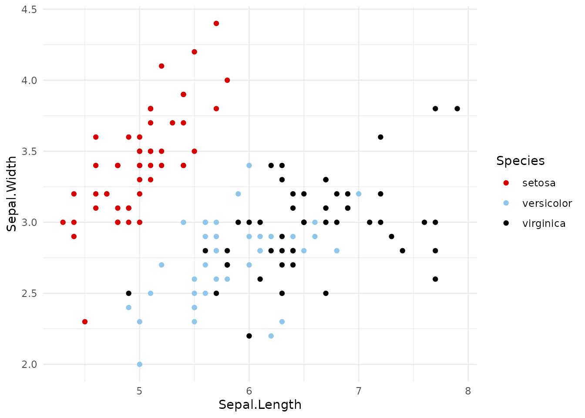

If you don’t use the full setup ([`theme_cleanplots()`](../reference/theme_cleanplots.html) or [`cleanplots_defaults()`](../reference/cleanplots_defaults.html), below), I recommend adding [`theme_minimal()`](https://ggplot2.tidyverse.org/reference/ggtheme.html) to your plots: the colors and markers are much easier to see on a white background than on ggplot2’s default gray. The examples on this page do this.

Both scales take the same options:

- `palette`: `"default"` (the main colors) or `"bars"` (softer versions for bars, areas, and pie charts; more on this below)
- `order`: use the colors in a different order; e.g., `order = c(7, 1, 2)` starts with navy
- `reverse`: reverse the order of the colors

```r
ggplot(iris, aes(Sepal.Length, Sepal.Width, color = Species)) +
  geom_point() +
  scale_color_cleanplots(order = c(7, 1, 2)) +
  theme_minimal()
```

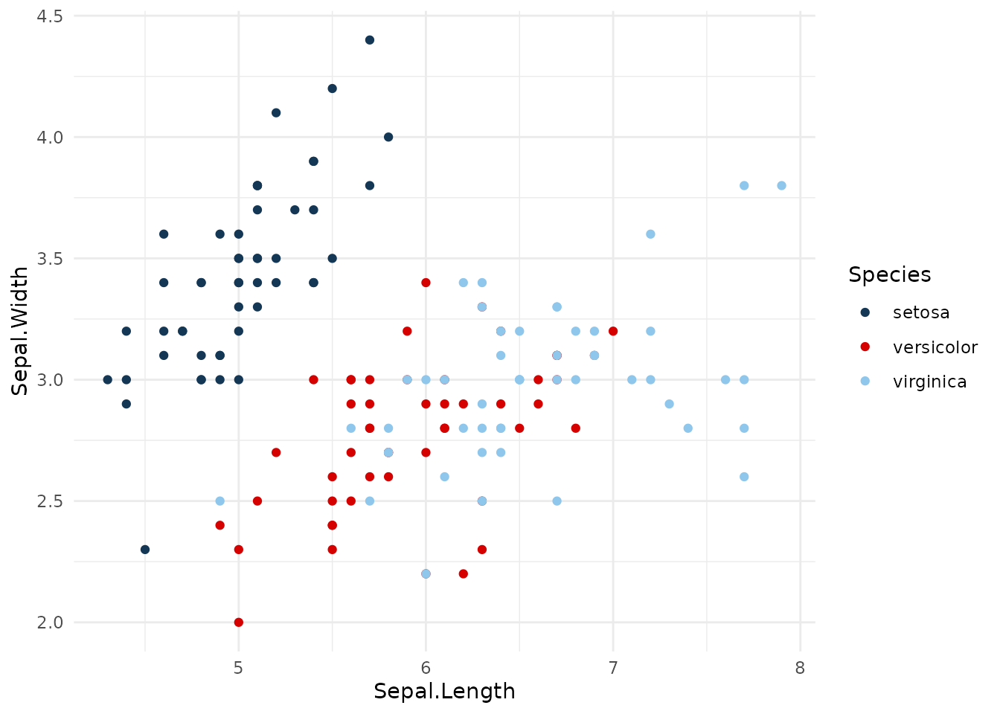

To use individual colors by hand, [`cleanplots_colors()`](../reference/cleanplots_colors.html) gives their hex codes by name:

::: {.r-run}
```r
cleanplots_colors()
```
```{.r-output}
      red    ltblue     black      gray    purple      pink      navy    ltgray 
"#D50000" "#8FC6EB" "#000000" "#909090" "#740074" "#FFB3D9" "#143755" "#C0C0C0" 
   dkgray  lavender 
"#404040" "#D9D7F0"
```
:::

::: {.r-run}
```r
cleanplots_colors("red", "navy")
```
```{.r-output}
      red      navy 
"#D50000" "#143755"
```
:::

## 2. The two palettes

The **main colors** are for markers, lines, and confidence intervals. They alternate between darker and lighter, so the first several groups can still be told apart when printed in black and white. There is no red-green pair (red-green color blindness is the most common type, affecting about 8% of men).

The **bar colors** are softer versions of the same colors. Bars, areas, and pie slices use much more ink than points and lines, so full-strength colors can overwhelm a figure. cleanplots uses lighter fills for these:

```r
titanic <- aggregate(Freq ~ Class + Sex, data = as.data.frame(Titanic), sum)

ggplot(titanic, aes(Sex, Freq, fill = Class)) +
  geom_col(position = "dodge") +
  scale_fill_cleanplots(palette = "bars") +
  labs(x = NULL, y = "Passengers and crew", fill = "Class") +
  theme_minimal()
```

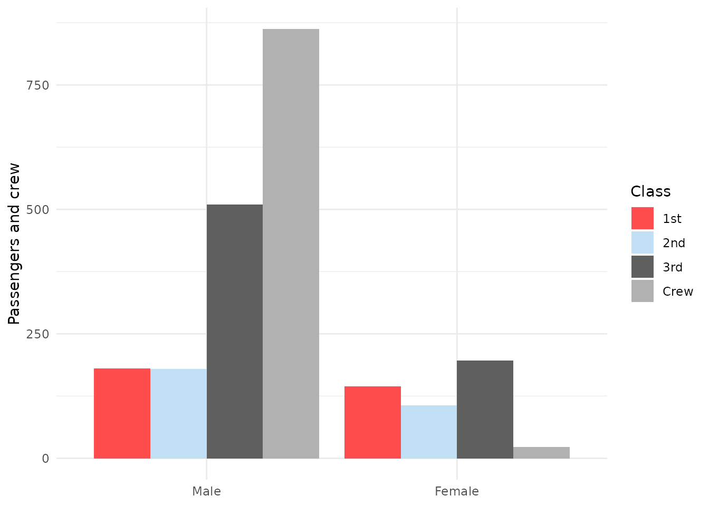

### Ordinal categories: use viridis

The cleanplots colors are for **nominal** (unordered) groups. For **ordinal** categories, such as Likert responses or education levels, use colors that get darker (or lighter) in order, so the order is still clear to colorblind readers and in black and white. I recommend **cividis** (Nunez, Anderton, & Renslow 2018), a version of viridis (van der Walt & Smith 2015) designed so that readers with red-green color blindness see essentially the same colors as everyone else. It is built into ggplot2 and works with all the other cleanplots features:

```r
ggplot(diamonds, aes(price, color = cut)) +
  geom_density(linewidth = 0.65) +
  scale_color_viridis_d(option = "cividis", end = 0.95, direction = -1) +
  labs(x = "Price") +
  theme_minimal()
```

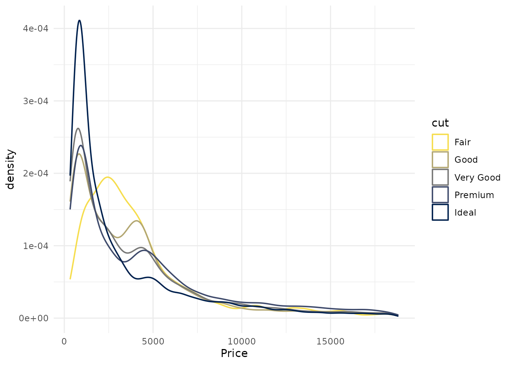

A few notes. `end = 0.95` trims the lightest color so it stays visible on a white background (use `begin = 0.05` instead if the darkest color would sit on a dark fill). You can combine the cividis colors with the cleanplots shapes and line patterns to make groups even easier to tell apart. And if you have run [`cleanplots_defaults()`](../reference/cleanplots_defaults.html), adding a viridis scale changes the colors for that plot only; the theme, sizes, and everything else stay the same.

These are the same colors used by the ordinal cleanplots schemes for Stata (`cleanplots3`, `cleanplots5`, `cleanplots7`, `cleanplots9`, `cleanplots11`).

Nunez, J. R., Anderton, C. R., & Renslow, R. S. (2018). Optimizing colormaps with consideration for color vision deficiency to enable accurate interpretation of scientific data. *PLOS ONE*, 13(7), e0199239.

## 3. Shapes and line patterns

Color alone can reliably tell apart about four or five groups. To go beyond that, and to help colorblind readers and black-and-white printing, cleanplots varies **several things at once**, so no two groups ever depend on a single cue:

- **Color and lightness**: the colors alternate between dark and light.
- **Marker shape and fill**: [`scale_shape_cleanplots()`](../reference/scale_shape_cleanplots.html) gives hollow shapes (circle, square, triangle, diamond) to the dark colors and solid shapes to the light colors.
- **Line pattern**: [`scale_linetype_cleanplots()`](../reference/scale_shape_cleanplots.html) assigns patterns in pairs, from closest to solid to furthest: solid, solid, longdash, longdash, twodash, twodash, dashed, dashed, dotdash, dotdash.

These work together: any two groups that share a shape or line pattern always differ a lot in lightness, so every pair of groups differs in at least two ways.

```r
ggplot(mpg, aes(displ, hwy, color = class, shape = class)) +
  geom_point(size = 1.4, stroke = 0.7) +
  scale_color_cleanplots() +
  scale_shape_cleanplots() +
  theme_minimal()
```

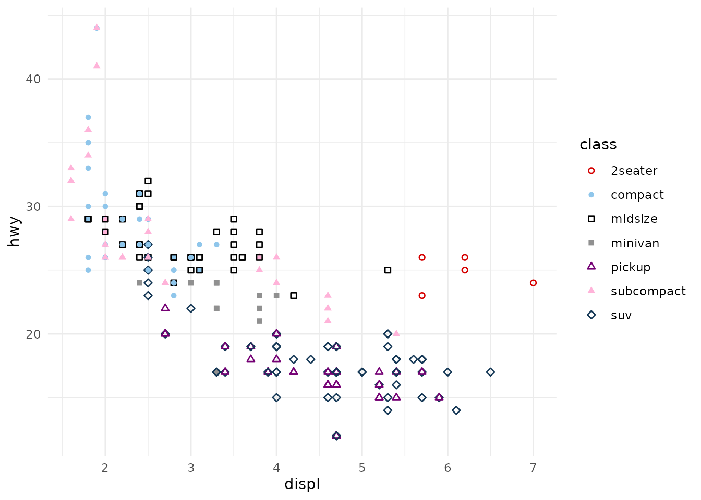

```r
cities <- c("Collin County", "Austin", "Dallas", "Corpus Christi",
            "Wichita Falls")
tx <- aggregate(median ~ year + city, mean, na.rm = TRUE,
                data = subset(txhousing, city %in% cities))

ggplot(tx, aes(year, median / 1000, color = city, linetype = city)) +
  geom_line(linewidth = 0.65) +
  scale_color_cleanplots() +
  scale_linetype_cleanplots() +
  labs(x = NULL, y = "Median home price ($1,000s)", color = "", linetype = "") +
  theme_minimal()
```

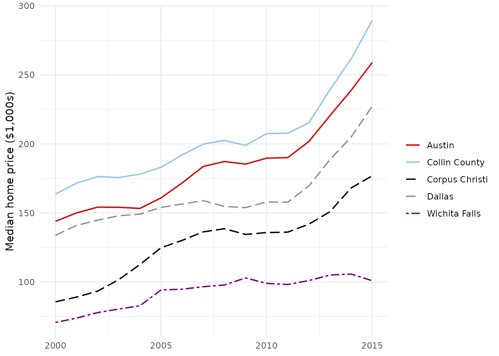

## 4. The theme

[`theme_cleanplots()`](../reference/theme_cleanplots.html) gives the cleanplots layout: a white background, no plot border, light gray axis lines, dotted gridlines, a legend at the right with no frame, and facet labels in black-outlined boxes. Like any ggplot2 theme, add it to a plot:

```r
ggplot(mpg, aes(displ, hwy, color = class, shape = class)) +
  geom_point(size = 1.4, stroke = 0.7) +
  scale_color_cleanplots() +
  scale_shape_cleanplots() +
  theme_cleanplots()
```


## 5. The full setup: `cleanplots_defaults()`

Adding scales and themes to every plot gets repetitive. One call at the top of your script sets up cleanplots for the whole session:

```r
cleanplots_defaults()
```

After this, **without adding any scales or theme**:

- every plot uses [`theme_cleanplots()`](../reference/theme_cleanplots.html);
- `color` uses the main colors and `fill` uses the softer bar colors (so bars and areas automatically get the lighter colors);
- points are larger with heavier outlines (`size = 1.4`, `stroke = 0.7`), so the hollow markers are easy to see;
- lines are thicker (`linewidth = 0.65`) for [`geom_line()`](https://ggplot2.tidyverse.org/reference/geom_path.html), [`geom_path()`](https://ggplot2.tidyverse.org/reference/geom_path.html), [`geom_step()`](https://ggplot2.tidyverse.org/reference/geom_path.html), [`geom_density()`](https://ggplot2.tidyverse.org/reference/geom_density.html), [`geom_function()`](https://ggplot2.tidyverse.org/reference/geom_function.html), and [`geom_smooth()`](https://ggplot2.tidyverse.org/reference/geom_smooth.html); error bars, line ranges, and point ranges use 80% of that;
- [`geom_smooth()`](https://ggplot2.tidyverse.org/reference/geom_smooth.html) fit lines are cleanplots red with a light gray confidence band instead of ggplot2’s blue.

```r
ggplot(mpg, aes(displ, hwy, color = class, shape = class)) +
  geom_point() +
  scale_shape_cleanplots()
```

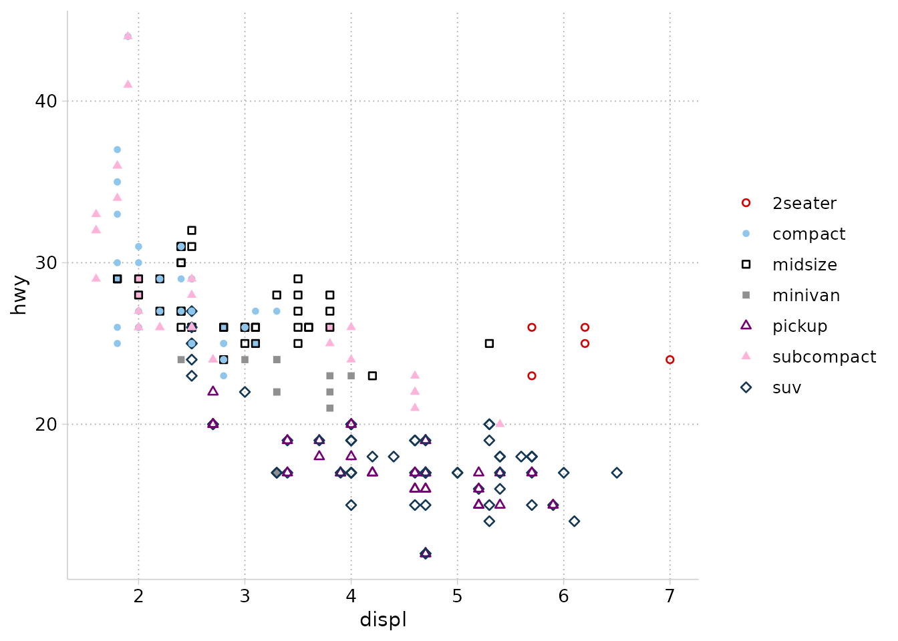

```r
ggplot(mpg, aes(displ, hwy)) +
  geom_point(color = cleanplots_colors("gray")) +
  geom_smooth(method = "loess", formula = y ~ x)
```

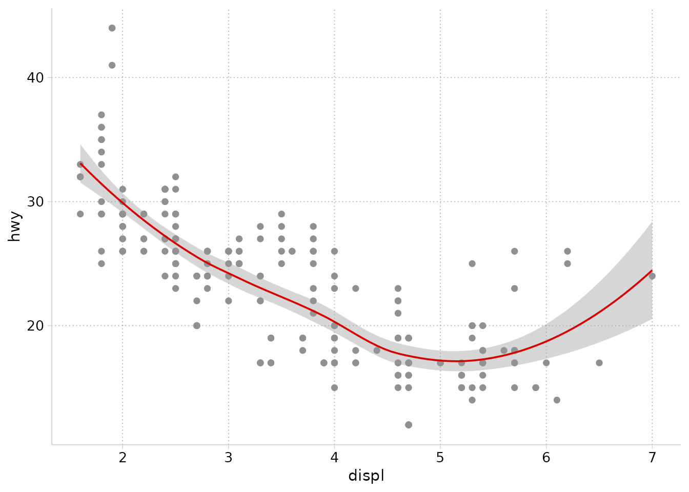

You can change any of these sizes:

```r
cleanplots_defaults(base_size = 12, point_size = 1.4,
                    point_stroke = 0.7, line_width = 0.65,
                    smooth_color = "#D50000")
```

The default text size (12) matches the body text of an academic article when the figure is saved at the recommended size (see the next section): if you can read the article, you can read the graph. For presentations and lectures, make it bigger:

```r
cleanplots_defaults(base_size = 16)   # presentations and lectures
```

One important exception: ggplot2 only lets you set session defaults for `color` and `fill`, so **shapes and line patterns can’t be applied automatically**. Whenever you map `shape` or `linetype` to a variable, add [`scale_shape_cleanplots()`](../reference/scale_shape_cleanplots.html) or [`scale_linetype_cleanplots()`](../reference/scale_shape_cleanplots.html) to that plot. This matters most with seven or more groups: ggplot2’s built-in shapes stop at six and silently drop the markers for any other groups, while [`scale_shape_cleanplots()`](../reference/scale_shape_cleanplots.html) has ten.

You can still change anything on a single plot: a scale, theme, or setting you add to a plot always wins. For example, to use the main colors for a fill instead of the automatic bar colors:

```r
ggplot(titanic, aes(Sex, Freq, fill = Class)) +
  geom_col(position = "dodge") +
  scale_fill_cleanplots(palette = "default") +
  labs(x = NULL, y = "Passengers and crew", fill = "Class")
```

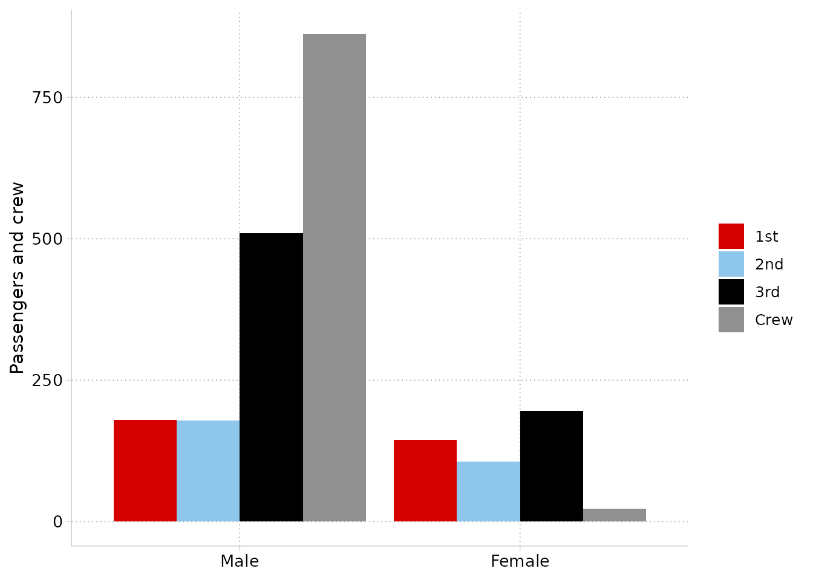

**To go back to ggplot2’s defaults**: [`cleanplots_defaults()`](../reference/cleanplots_defaults.html) lasts until you restart R. To reset it without restarting:

```r
theme_set(theme_gray())
options(ggplot2.discrete.colour = NULL, ggplot2.discrete.fill = NULL)
update_geom_defaults("point", list(size = 1.5, stroke = 0.5))
```

## 6. Saving figures

An important quirk of ggplot2 is that a plot has no built-in size. Text, markers, and lines are set in physical units (points and millimeters), and [`ggsave()`](https://ggplot2.tidyverse.org/reference/ggsave.html) **without explicit dimensions saves at whatever size your plot window happens to be**. So the same code can produce figures with different proportions on different days and computers.

The fix is to always save at a set size. [`cleanplots_save()`](../reference/cleanplots_save.html) does this for you, at 7 x 5 inches and 300 dpi:

```r
p <- ggplot(mpg, aes(displ, hwy, color = drv)) + geom_point()
cleanplots_save("my-figure.png", p)
```

Why 7 x 5? It matches the default figure size of R Markdown (HTML) documents, and a 7-inch figure placed at the 6.5-inch text width of a US-letter manuscript shrinks the 12-point default text to about 11 points, close to the article’s body text. The file extension sets the format, so `.pdf`, `.tiff`, or `.eps` files for journal submissions work directly. You can change any of the defaults:

```r
cleanplots_save("slide-figure.png", p, width = 10, height = 5.6)
```

The same idea applies to other ways of saving:

- **[`ggsave()`](https://ggplot2.tidyverse.org/reference/ggsave.html) directly**: always pass `width`, `height`, and `dpi`.
- **RStudio’s Export button**: type explicit dimensions in the dialog (e.g., 2100 x 1500 pixels = 7 x 5 inches at 300 dpi) rather than accepting the window size.
- **R Markdown / Quarto**: figures are sized by chunk options, so they already have a set size. To match [`cleanplots_save()`](../reference/cleanplots_save.html): `knitr::opts_chunk$set(fig.width = 7, fig.height = 5)` (or `fig-width`/`fig-height` in Quarto). Note that `pdf_document` defaults to 6.5 x 4.5 – article text width – which also works well.
- **Base devices** ([`png()`](https://rdrr.io/r/grDevices/png.html) … `print(p)` … [`dev.off()`](https://rdrr.io/r/grDevices/dev.html)): pass dimensions to the device call.

Avoid copying and pasting figures from the plot window into Word or PowerPoint: the result is sized to your window and at screen resolution.

## 7. Plots of predictions and marginal effects

cleanplots works with the [marginaleffects](https://marginaleffects.com) and [modelsummary](https://modelsummary.com) packages without any extra steps. After [`cleanplots_defaults()`](../reference/cleanplots_defaults.html), their plots use the cleanplots colors and theme automatically.

The examples below use data on life satisfaction across ages:

```r
sim <- readRDS(url(
  "https://raw.githubusercontent.com/tdmize/data/master/data/sim_lifesat.rds",
  open = "rb"))
```

A coefficient plot of nested models with [`modelsummary::modelplot()`](https://modelsummary.com/man/modelplot.html):

```r
mod1 <- lm(lifesat ~ age + educ, data = sim)
mod2 <- lm(lifesat ~ age + educ + married, data = sim)

modelsummary::modelplot(list("Baseline" = mod1, "+ Marriage" = mod2),
                        coef_omit = "Intercept") +
  geom_vline(xintercept = 0, linetype = "dashed", color = "gray50") +
  labs(x = "Coefficient estimates and 95% confidence intervals")
```

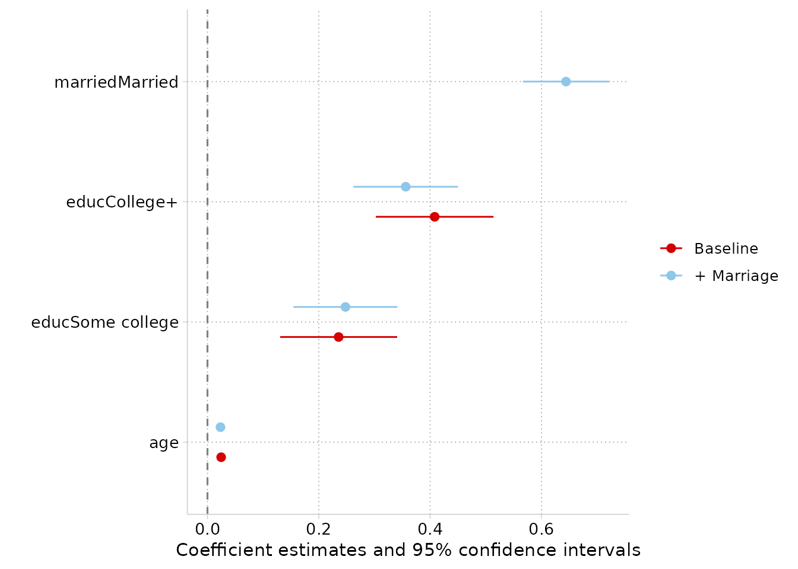

Adjusted predictions for a nominal predictor with [`marginaleffects::plot_predictions()`](https://rdrr.io/pkg/marginaleffects/man/plot_predictions.html):

```r
mod <- lm(lifesat ~ poly(age, 2) * married + educ, data = sim)

marginaleffects::plot_predictions(mod, condition = c("educ", "married")) +
  labs(y = "Predicted life satisfaction")
```

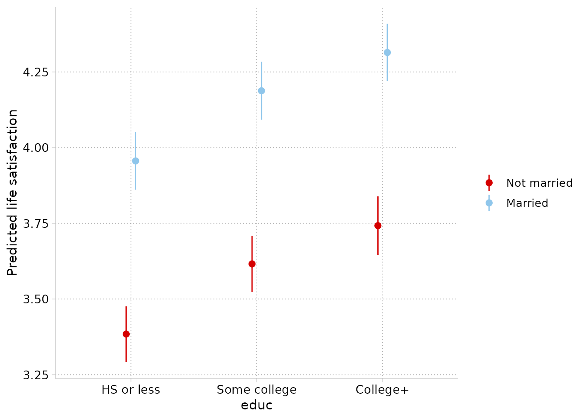

Predictions across a continuous predictor by group. One note: `plot_predictions()` draws its confidence intervals with very light shading (alpha = 0.1), which is meant for strong colors. Add `scale_fill_cleanplots(palette = "default")` so the intervals use the full-strength colors rather than the softer bar colors:

```r
marginaleffects::plot_predictions(mod, condition = c("age", "married")) +
  scale_fill_cleanplots(palette = "default") +
  labs(y = "Predicted life satisfaction")
```

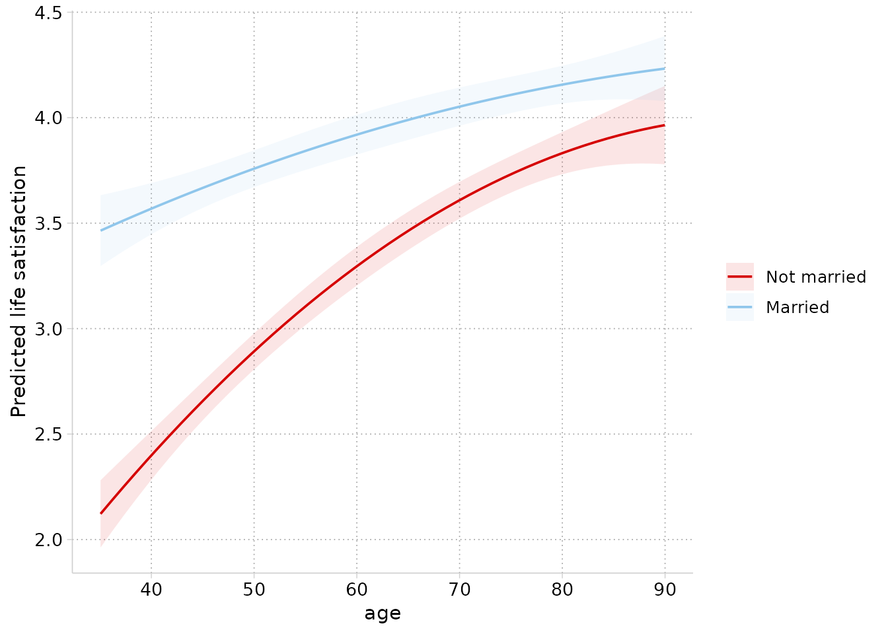

For full control of the intervals (or anything else), use `plot_predictions(..., draw = FALSE)` to get the data and build the figure yourself:

```r
pr <- marginaleffects::plot_predictions(
  mod, condition = c("age", "married"), draw = FALSE)

ggplot(pr, aes(age, estimate, color = married, fill = married)) +
  geom_ribbon(aes(ymin = conf.low, ymax = conf.high),
              alpha = .35, color = NA) +
  geom_line() +
  labs(y = "Predicted life satisfaction")
```

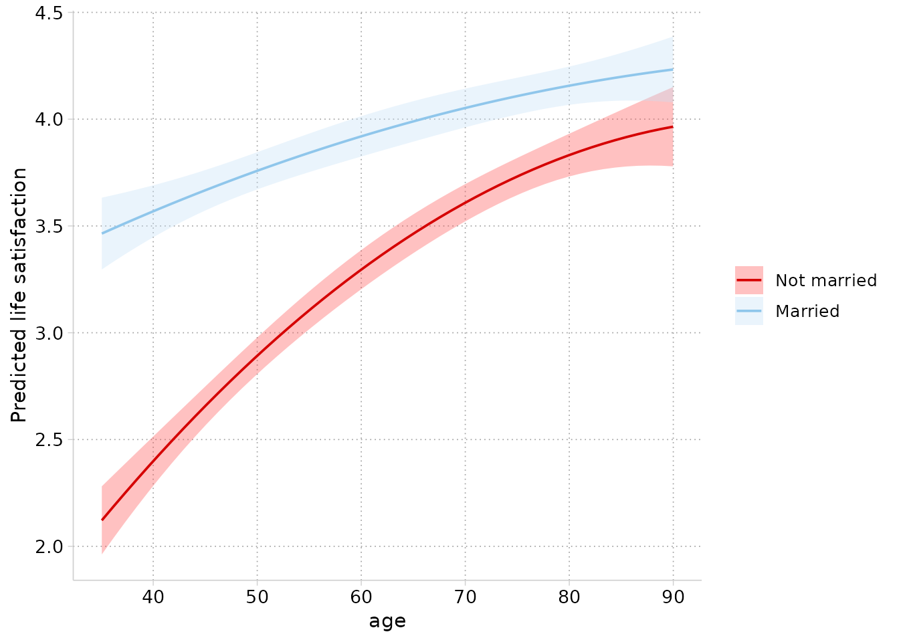

And comparisons (here, the marriage gap in life satisfaction across ages) with [`marginaleffects::plot_comparisons()`](https://rdrr.io/pkg/marginaleffects/man/plot_comparisons.html):

```r
marginaleffects::plot_comparisons(mod, variables = "married",
                                  condition = "age") +
  geom_hline(yintercept = 0, linetype = "dashed", color = "gray50") +
  labs(y = "Difference in predicted life satisfaction\n(Married - Not married)")
```

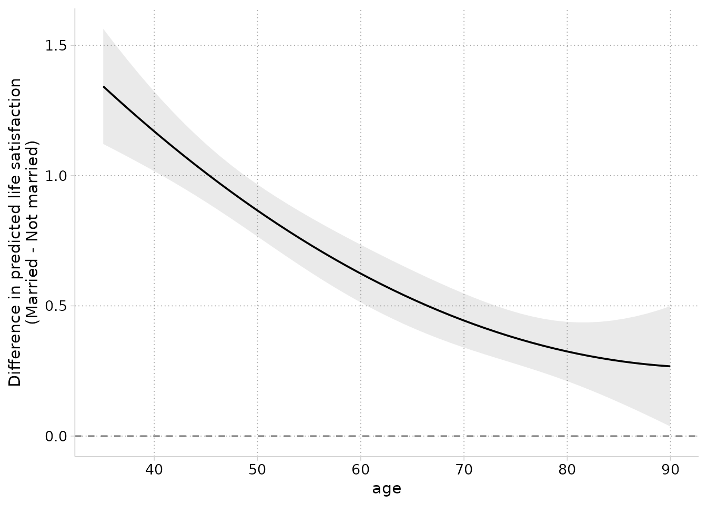

## 8. For Stata users

If you use the cleanplots scheme in Stata, here is how its settings correspond to this package:

| Stata | R |
|------------------------------------|------------------------------------|
| `set scheme cleanplots` | [`cleanplots_defaults()`](../reference/cleanplots_defaults.html) |
| `p1`–`p10` colors | [`scale_color_cleanplots()`](../reference/scale_color_cleanplots.html) |
| `p1bar`–`p10bar` colors at `intensity bar 70` | `scale_fill_cleanplots(palette = "bars")` |
| marker symbols (`symbol p1` …) | [`scale_shape_cleanplots()`](../reference/scale_shape_cleanplots.html) |
| line patterns (`linepattern p1line` …) | [`scale_linetype_cleanplots()`](../reference/scale_shape_cleanplots.html) |
| scheme layout settings | [`theme_cleanplots()`](../reference/theme_cleanplots.html) |
| graph export sizing | [`cleanplots_save()`](../reference/cleanplots_save.html) |

The Stata scheme is on my website at [https://www.trentonmize.com/software/cleanplots](/software/cleanplots/index.qmd).
