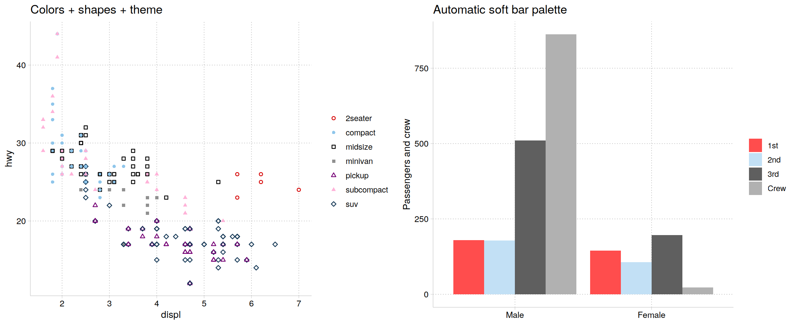

cleanplots is a graphics scheme for **ggplot2** that makes clean, professional-looking figures by default. It is the R version of my [cleanplots scheme for Stata](/software/cleanplots/index.qmd), so figures made in R and Stata look the same.

The colors are **colorblind-friendly** and stay **distinguishable when printed in black and white**. Groups also get matching marker shapes and line patterns, so readers can tell them apart even without color.

## Installation

```r
# install.packages("remotes")
remotes::install_github("tdmize/cleanplots")
```

## Usage

The easiest way to use cleanplots is to run [`cleanplots_defaults()`](reference/cleanplots_defaults.html) once at the top of your script. It sets the theme, makes markers and lines larger and easier to see, and applies the cleanplots colors to every plot (the main colors for `color` and the softer bar colors for `fill`):

```r
library(ggplot2)
library(cleanplots)
cleanplots_defaults()

ggplot(mpg, aes(displ, hwy, color = class, shape = class)) +
  geom_point() +
  scale_shape_cleanplots()

cleanplots_save("my-figure.png")   # saves at a fixed 7 x 5 in, 300 dpi
```

You can also add the pieces to individual plots instead. If you don’t use the full setup, I recommend adding [`theme_minimal()`](https://ggplot2.tidyverse.org/reference/ggtheme.html) or [`theme_cleanplots()`](reference/theme_cleanplots.html): the colors and markers are much easier to see on a white background.

```r
library(ggplot2)
library(cleanplots)

# Scatterplot with the main palette and theme
ggplot(iris, aes(x = Sepal.Length, y = Sepal.Width, color = Species)) +
  geom_point(size = 2) +
  theme_cleanplots() +
  scale_color_cleanplots()

# Bar charts use the softer bar/area palette
titanic <- aggregate(Freq ~ Class + Sex, data = as.data.frame(Titanic), sum)
ggplot(titanic, aes(Sex, Freq, fill = Class)) +
  geom_col(position = "dodge") +
  theme_cleanplots() +
  scale_fill_cleanplots(palette = "bars")

# Reorder or reverse the colors
scale_color_cleanplots(order = c(7, 1, 2))
scale_color_cleanplots(reverse = TRUE)

# Extract hex codes directly
cleanplots_colors()
cleanplots_colors("red", "navy")
cleanplots_colors(bars = TRUE)
```



## The palettes

**Main colors** (`palette = "default"`) are for markers, lines, and confidence intervals:

| \#  | Name     | Hex       | Definition     |
|-----|----------|-----------|----------------|
| 1   | red      | `#D50000` | `red*1.2`      |
| 2   | ltblue   | `#8FC6EB` | `eltblue*.9`   |
| 3   | black    | `#000000` | `black`        |
| 4   | gray     | `#909090` | `gs9`          |
| 5   | purple   | `#740074` | `purple*1.1`   |
| 6   | pink     | `#FFB3D9` | `pink*.3`      |
| 7   | navy     | `#143755` | `navy*1.3`     |
| 8   | ltgray   | `#C0C0C0` | `gs12`         |
| 9   | dkgray   | `#404040` | `gs4`          |
| 10  | lavender | `#D9D7F0` | `lavender*.35` |

**Bar colors** (`palette = "bars"`) are softer versions for bar charts, area plots, and pie charts, which use much more ink than points and lines:

| \#  | Name     | Hex       | Definition          |
|-----|----------|-----------|---------------------|
| 1   | red      | `#FF4D4D` | `red` @ 70%         |
| 2   | ltblue   | `#C2E0F5` | `eltblue*.7` @ 70%  |
| 3   | black    | `#5F5F5F` | `black*.9` @ 70%    |
| 4   | gray     | `#B1B1B1` | `gs9` @ 70%         |
| 5   | purple   | `#AF5FAF` | `purple*.9` @ 70%   |
| 6   | pink     | `#FFDBEE` | `pink*.2` @ 70%     |
| 7   | navy     | `#5D7A93` | `navy*1.1` @ 70%    |
| 8   | ltgray   | `#D3D3D3` | `gs12` @ 70%        |
| 9   | dkgray   | `#909090` | `gs6` @ 70%         |
| 10  | lavender | `#E8E7F6` | `lavender*.3` @ 70% |

## Shapes and line patterns

Color alone can reliably tell apart about four or five groups. To go beyond that, and to help readers who are colorblind or who print in black and white, cleanplots also varies marker shapes and line patterns:

- [`scale_shape_cleanplots()`](reference/scale_shape_cleanplots.html) uses hollow markers for the dark colors and solid markers for the light colors.
- [`scale_linetype_cleanplots()`](reference/scale_shape_cleanplots.html) assigns line patterns in pairs, from closest to solid to furthest: solid, solid, longdash, longdash, twodash, twodash, dashed, dashed, dotdash, dotdash.

Any two groups that share a shape or line pattern always differ a lot in lightness, so every group stays distinct.

```r
ggplot(mpg, aes(displ, hwy, color = class, shape = class)) +
  geom_point(size = 2) +
  theme_cleanplots() +
  scale_color_cleanplots() +
  scale_shape_cleanplots()
```

## Design goals

The colors alternate between dark and light, so the first several groups can be told apart by lightness alone in black and white. There is no red-green pair, and the first five colors pass simulation checks for the three main types of color blindness. You can check the palette yourself at [Coloring for Colorblindness](https://davidmathlogic.com/colorblind/#%23D50000-%238FC6EB-%23000000-%23909090-%23740074-%23FFB3D9-%23143755-%23C0C0C0-%23404040-%23D9D7F0).

## The theme

[`theme_cleanplots()`](reference/theme_cleanplots.html) gives a white background with no plot border, light gray axis lines and ticks, dotted light gray gridlines, a legend at the right with no frame or title, and bold facet labels in black-outlined boxes. To add the legend title back:

```r
theme_cleanplots() + theme(legend.title = element_text())
```

## cleanplots for Stata

The original Stata scheme is on my website at [https://www.trentonmize.com/software/cleanplots](/software/cleanplots/index.qmd). To install it in Stata:

```r
net install cleanplots, from("https://tdmize.github.io/data/cleanplots") replace
```

Its colors, marker symbols, line patterns, and layout match this package, so figures made in R and Stata look alike.
