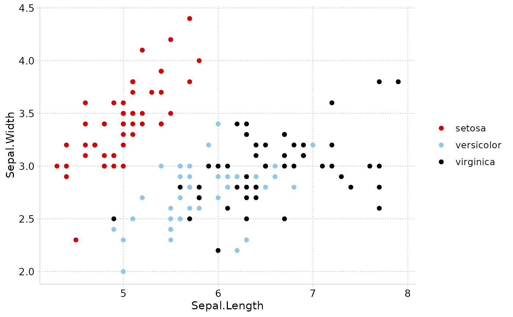

One call sets up cleanplots for the rest of the session: it makes [`theme_cleanplots()`](theme_cleanplots.html) the default theme, makes points and lines larger and thicker, and uses the cleanplots colors for every plot, so you don't have to add scales by hand.

## Usage

```r
cleanplots_defaults(
  base_size = 12,
  point_size = 1.4,
  point_stroke = 0.7,
  line_width = 0.65,
  smooth_color = "#D50000"
)
```

## Arguments

base_size

: Base font size in points passed to [`theme_cleanplots()`](theme_cleanplots.html) (default: `12`).

point_size

: Default size for [`geom_point()`](https://ggplot2.tidyverse.org/reference/geom_point.html) markers (default: `1.4`). The midpoint dot of [`geom_pointrange()`](https://ggplot2.tidyverse.org/reference/geom_linerange.html) (used in coefficient plots) is sized to match.

point_stroke

: Default outline thickness for markers, which controls how visible the hollow shapes are (default: `0.7`; ggplot2's own default is 0.5).

line_width

: Default line width for [`geom_line()`](https://ggplot2.tidyverse.org/reference/geom_path.html), [`geom_path()`](https://ggplot2.tidyverse.org/reference/geom_path.html), [`geom_step()`](https://ggplot2.tidyverse.org/reference/geom_path.html), [`geom_density()`](https://ggplot2.tidyverse.org/reference/geom_density.html), [`geom_function()`](https://ggplot2.tidyverse.org/reference/geom_function.html), and [`geom_smooth()`](https://ggplot2.tidyverse.org/reference/geom_smooth.html) (default: `0.65`; ggplot2's own default is 0.5). Error bars, line ranges, and point ranges are set to 80% of this value. Reference lines ([`geom_hline()`](https://ggplot2.tidyverse.org/reference/geom_abline.html), [`geom_vline()`](https://ggplot2.tidyverse.org/reference/geom_abline.html), [`geom_abline()`](https://ggplot2.tidyverse.org/reference/geom_abline.html)) are deliberately left thin and unobtrusive.

smooth_color

: Default line color for [`geom_smooth()`](https://ggplot2.tidyverse.org/reference/geom_smooth.html) (default: cleanplots red, `"#D50000"`).

## Value

Invisibly returns `NULL`; called for its side effects.

## Details

After calling `cleanplots_defaults()`:

- All plots use [`theme_cleanplots()`](theme_cleanplots.html) unless another theme is added.

- [`geom_point()`](https://ggplot2.tidyverse.org/reference/geom_point.html) draws larger markers with a heavier outline (important for the hollow marker shapes).

- [`geom_line()`](https://ggplot2.tidyverse.org/reference/geom_path.html) and friends draw thicker lines so colors are visible.

- [`geom_smooth()`](https://ggplot2.tidyverse.org/reference/geom_smooth.html) fit lines default to cleanplots red with a light gray confidence band (instead of ggplot2's blue).

- Discrete `color` aesthetics default to the main cleanplots palette, and discrete `fill` aesthetics default to the softer bar palette (as in Stata, where bars and areas automatically use the softer colors). Add a scale explicitly to override, e.g. `scale_fill_cleanplots(palette = "default")`.

These are session-wide settings that affect all subsequent ggplot2 plots. To undo them, restart R or call `ggplot2::theme_set(ggplot2::theme_gray())`, [`ggplot2::update_geom_defaults()`](https://ggplot2.tidyverse.org/reference/update_defaults.html), and `options(ggplot2.discrete.colour = NULL, ggplot2.discrete.fill = NULL)`.

## Examples

```r
library(ggplot2)
cleanplots_defaults()

# No scales or theme needed -- everything is applied by default
ggplot(iris, aes(Sepal.Length, Sepal.Width, color = Species)) +
  geom_point()
```


