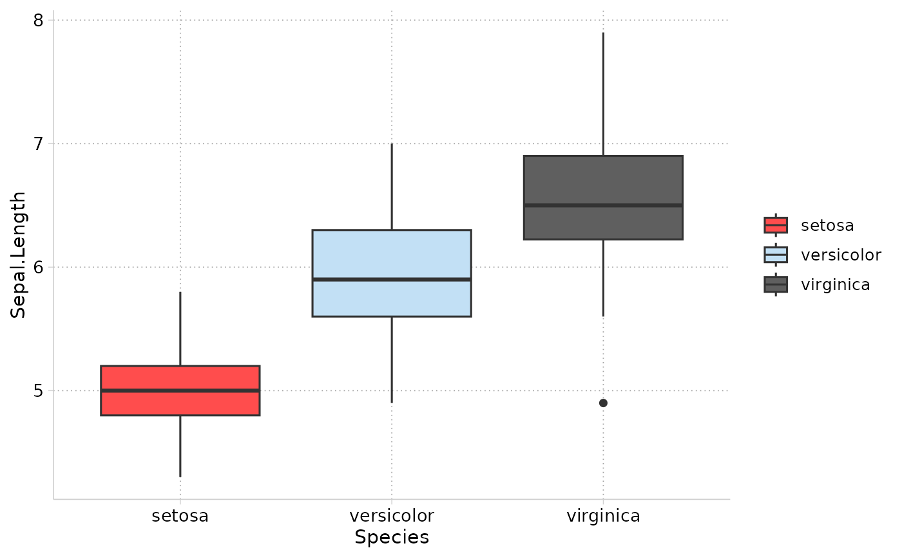
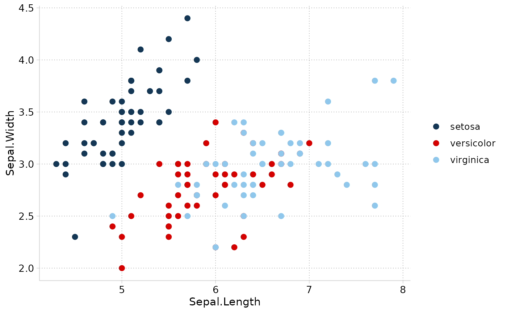

Color and fill scales for groups that use the cleanplots colors, the same colors as my `cleanplots` scheme for Stata. They are designed for clean, publication-ready plots, including plots of predictions and marginal effects.

## Usage

```r
scale_color_cleanplots(
  palette = "default",
  reverse = FALSE,
  order = 1:10,
  aesthetics = "color",
  ...
)

scale_colour_cleanplots(
  palette = "default",
  reverse = FALSE,
  order = 1:10,
  aesthetics = "color",
  ...
)

scale_fill_cleanplots(
  palette = "default",
  reverse = FALSE,
  order = 1:10,
  aesthetics = "fill",
  ...
)
```

## Arguments

palette

: Character name of palette: `"default"` or `"bars"`.

reverse

: Logical. Should the palette be reversed?

order

: A vector of numbers from 1 to 10 indicating the order of colors to use (default: `1:10`).

aesthetics

: A vector of aesthetic names this scale should apply to (e.g., `"color"` or `"fill"`).

...

: Additional arguments passed to [`ggplot2::discrete_scale()`](https://ggplot2.tidyverse.org/reference/discrete_scale.html).

## Details

The `"default"` palette contains the 10 colors used for markers, lines, and confidence intervals. The `"bars"` palette contains the softer, lighter versions of the same colors that the Stata scheme uses for bar charts, area plots, and pie charts (because those elements use much more ink); it is typically paired with `scale_fill_cleanplots()`.

The cleanplots palette is only available as a discrete palette.

## References

Mize, T. D. cleanplots: Stata graphing scheme. [https://www.trentonmize.com/software/cleanplots](/software/cleanplots/index.qmd)

## Examples

```r
library(ggplot2)

ggplot(iris, aes(x = Sepal.Length, y = Sepal.Width, color = Species)) +
  geom_point(size = 2) +
  theme_cleanplots() +
  scale_color_cleanplots()
```


```r
ggplot(iris, aes(x = Species, y = Sepal.Length, fill = Species)) +
  geom_boxplot() +
  theme_cleanplots() +
  scale_fill_cleanplots(palette = "bars")
```



```r
# Use colors in a different order
ggplot(iris, aes(x = Sepal.Length, y = Sepal.Width, color = Species)) +
  geom_point(size = 2) +
  theme_cleanplots() +
  scale_color_cleanplots(order = c(7, 1, 2))
```


