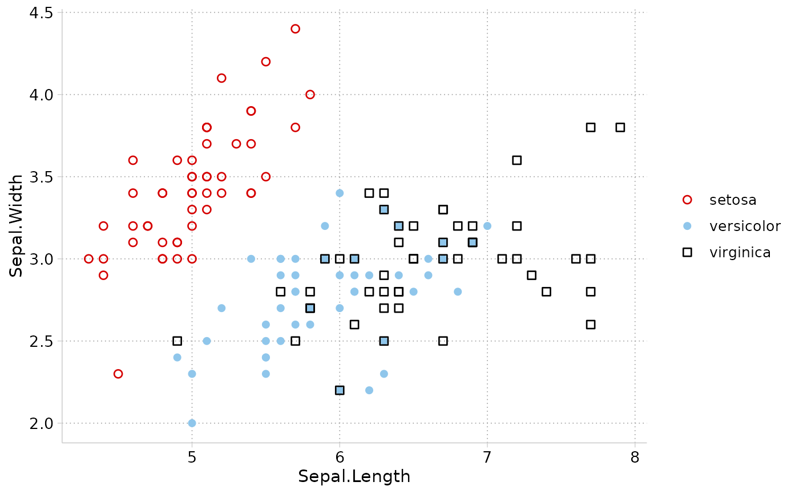
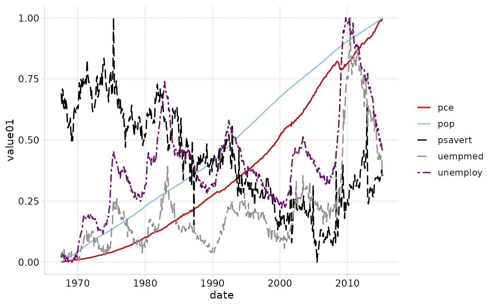

Discrete shape and linetype scales matching the marker symbols and line patterns of the cleanplots scheme. Combined with [`scale_color_cleanplots()`](scale_color_cleanplots.html), these make series distinguishable even when printed in black & white or viewed with colorblindness: markers alternate hollow (dark colors) and solid (light colors) shapes, and series that share a line pattern always differ strongly in lightness.

## Usage

```r
scale_shape_cleanplots(...)

scale_linetype_cleanplots(...)
```

## Arguments

...

: Additional arguments passed to [`ggplot2::scale_shape_manual()`](https://ggplot2.tidyverse.org/reference/scale_manual.html) or [`ggplot2::scale_linetype_manual()`](https://ggplot2.tidyverse.org/reference/scale_manual.html).

## Examples

```r
library(ggplot2)

ggplot(iris, aes(Sepal.Length, Sepal.Width,
                 color = Species, shape = Species)) +
  geom_point(size = 2) +
  theme_cleanplots() +
  scale_color_cleanplots() +
  scale_shape_cleanplots()
```



```r
ggplot(economics_long, aes(date, value01,
                           color = variable, linetype = variable)) +
  geom_line() +
  theme_cleanplots() +
  scale_color_cleanplots() +
  scale_linetype_cleanplots()
```


