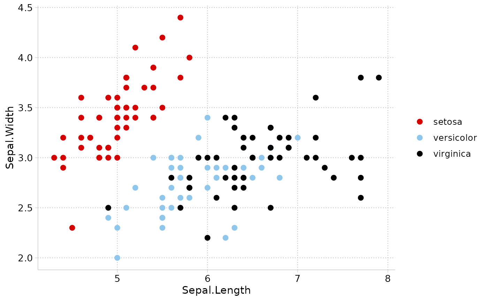

A ggplot2 theme with the non-color settings of my Stata `cleanplots` scheme: a white background, no border around the plot, light gray axis lines and ticks, dotted light gray gridlines, and a legend at the right with no frame.

## Usage

```r
theme_cleanplots(base_size = 12, base_family = "", legend_position = "right")
```

## Arguments

base_size

: Base font size in points (default: `12`, sized to match the body text of an academic article when the figure is saved at 7 x 5 inches; see [`cleanplots_save()`](cleanplots_save.html)).

base_family

: Base font family (default: `""`).

legend_position

: Position of the legend (default: `"right"`, vertically centered). Set to `"none"` to remove, or any value accepted by `ggplot2::theme(legend.position = ...)`.

## Value

A ggplot2 theme object.

## Details

Correspondence to the Stata scheme file:

- White background (`color background white`)

- No plot region border (`linestyle plotregion none`)

- Light gray axis lines and ticks (`color axisline gs13`, etc.)

- Dotted gs10 major gridlines, horizontal and vertical (`draw_major_hgrid yes`, `draw_major_vgrid yes`, `linepattern major_grid dot`, `color major_grid gs10`)

- No minor gridlines

- Legend at the right, single column, no frame, no title (`clockdir legend_position 3`, `numstyle legend_cols 1`, `linestyle legend none`)

- Horizontal y-axis tick labels (`anglestyle vertical_tick horizontal`)

- Facet strips: black-outlined, unfilled boxes with bold labels

## Examples

```r
library(ggplot2)

ggplot(iris, aes(x = Sepal.Length, y = Sepal.Width, color = Species)) +
  geom_point(size = 2) +
  theme_cleanplots() +
  scale_color_cleanplots()
```


