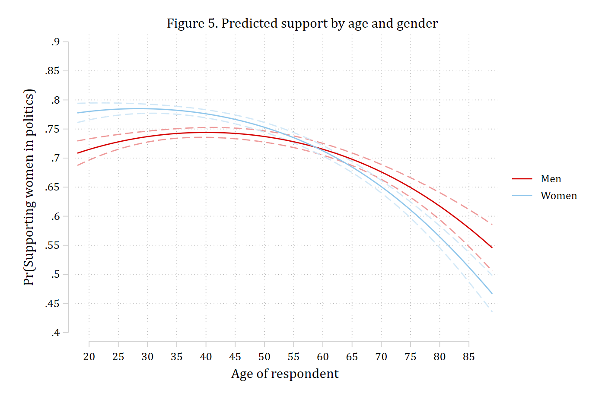
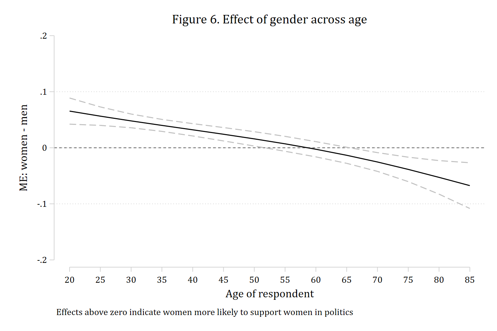
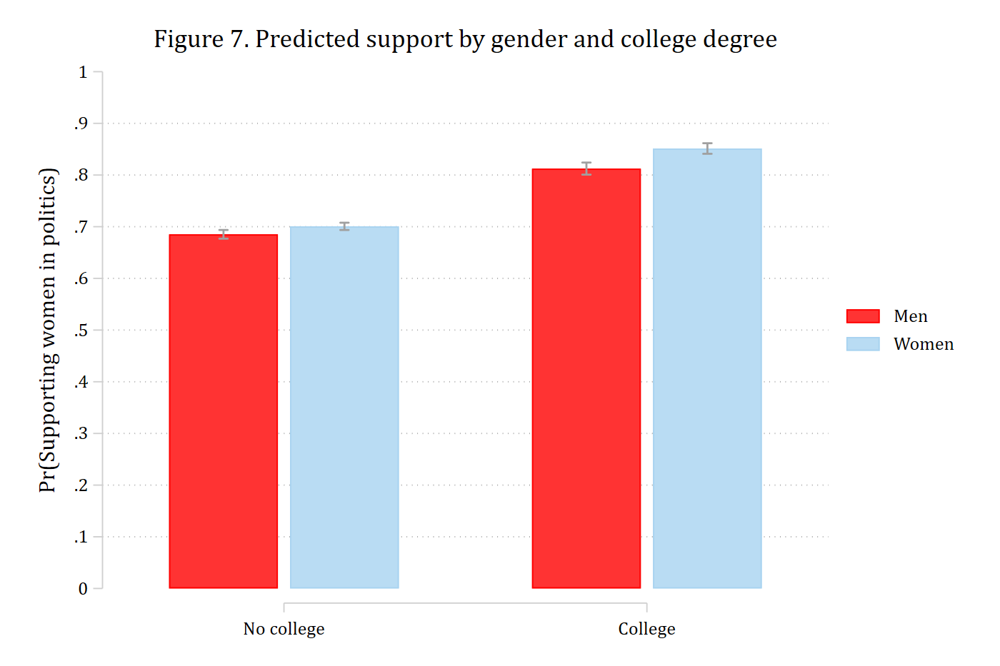
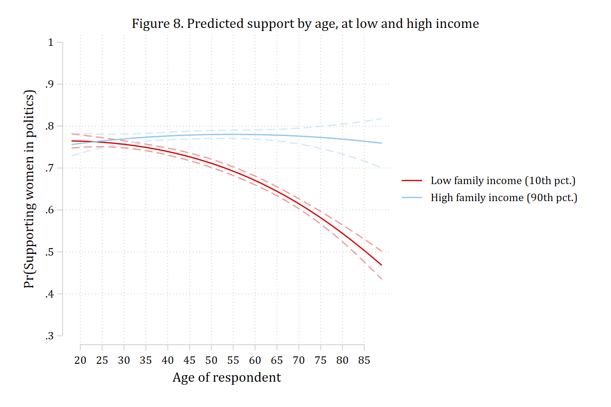
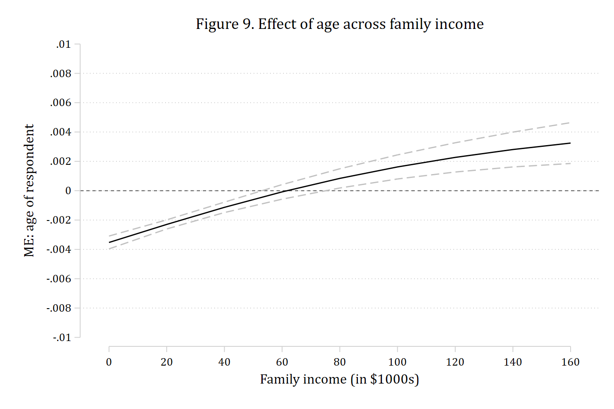
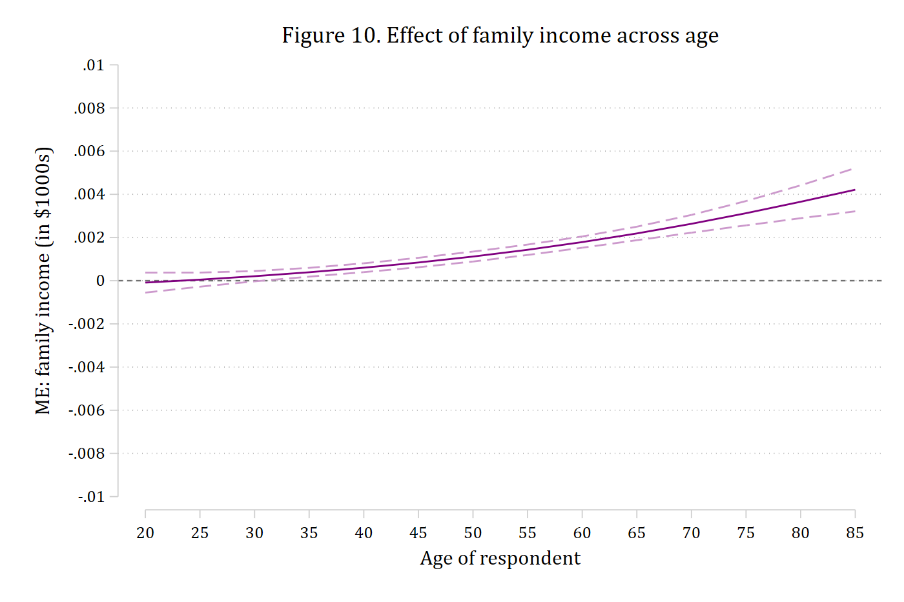

In nonlinear models the coefficient on a product term is not the test of
interaction. Mize and Han (forthcoming), following Mize (2019), recommend
plotting the predictions, calculating the marginal effect of the focal
variable at chosen levels of the moderator (first differences), and testing
whether those marginal effects differ (the second difference). This page
runs the chapter's Section 3 examples with `mecompare`: a continuous by
binary interaction from both sides, two binary variables, two continuous
variables, and the multi-category and three-way cases of Section 3.5. The
[Interactions](../interactions/index.html) pages cover the same methods
with the examples of Mize (2019).

Throughout, the outcome is whether a GSS respondent thinks women are suited
for politics, and the moderator is set with `by()` when it is binary or
nominal and with `covariates(z=(numlist))` when it is continuous.

## Age by gender: the effect of age for men and women (3.1)

The model is a logit of support for women in politics on age, age², and
gender, with all of their products.

```{.stata-run}
. use "https://tdmize.github.io/data/data/cda_gss", clear
(cda_gss.dta |  GSS 1972-2021 CDA - Categorical Data Analysis | date created 2023)

. drop if missing(fepolB, woman, age, college)
(32,134 observations deleted)

. 
. quietly logit fepolB c.age##c.age##i.woman, vce(robust)

. estimates store agemod

```

### Start with the predictions (Figure 5)

```{.stata-run}
. quietly margins woman, at(age=(18(1)89))

. marginsplot, recast(line) recastci(rline) ciopts(lpattern(dash) color(*.4)) ///
>     xlabel(20(5)85) ylabel(0.4(0.05)0.9) xtitle("Age of respondent") ///
>     ytitle("Pr(Supporting women in politics)") ///
>     title("Figure 5. Predicted support by age and gender")

Variables that uniquely identify margins: age woman

. graph export "fig/chapter-fepol-age-gender.png", replace width(1400)
file fig/chapter-fepol-age-gender.png saved as PNG format

```

{width=80% fig-alt="Predicted probability of supporting women in politics across age, for men and women. Young women are more supportive than young men; the gap closes around age 60 and reverses at older ages."}

Young women are more supportive than young men, but the gender gap shrinks
with age and reverses for the oldest respondents. The effect of age is
small or null at younger ages and clearly negative at older ages, so a
single summary of "the effect of age" will not do; the chapter calculates
the effect at ages 20, 30, and 60 as well as on average.

### Summary first differences and the second difference

The chapter's Equations 30--31 are the MEM of a standard-deviation change in
age for men and for women. `by(woman)` gives the effect for each gender (the
whole sample set to men, then to women), `start(atmeans) covariates(atmeans)`
makes it a MEM, and `amount(sd)` sets the change. The second difference -- is
the effect of age the same for men and women? -- is `metest 2 - 1`.

```{.stata-run}
. mecompare age, models(agemod) amount(sd) start(atmeans) covariates(atmeans) by(woman)

Predicting: Pr(fepolB)
Marginal effects (N_agemod=36712)

                                 |  ME #   Estimate  Robust SE      P>|z|
---------------------------------+---------------------------------------
age + SD (centered)              |                                       
                             Men |     1     -0.016      0.004      0.000
                           Women |     2     -0.045      0.003      0.000

. metest 2 - 1

                                 |  estimate         se     pvalue 
---------------------------------+--------------------------------
       age_woman_1 - age_woman_0 |    -0.029      0.005      0.000 

```

A standard-deviation increase in age reduces the probability of support by
about 0.02 for men and 0.05 for women; the second difference is significant,
so the effect of age is larger (more negative) for women.

### Marginal effects at chosen ages (Tables 2 and 3)

Table 2 of the chapter is the effect of a five-year increase in age starting
at 20, at 30, and at 60, separately for men and women. `start(age=(20 30
60))` gives one row per starting value, `amount(5) uncentered` makes each
change run upward from its start (20 to 25, 30 to 35, 60 to 65), and
`by(woman)` repeats the set for each gender. The rows are ordered by gender
first and then by starting age, so Table 3's second differences at each age
are `metest 4 - 1`, `metest 5 - 2`, and `metest 6 - 3`; `add` collects them
into one table.

```{.stata-run}
. mecompare age, models(agemod) start(age=(20 30 60)) amount(5) uncentered by(woman)

Predicting: Pr(fepolB)
Marginal effects (N_agemod=36712)

                                 |  ME #   Estimate  Robust SE      P>|z|
---------------------------------+---------------------------------------
age + 5 (uncentered)             |                                       
                       Men at 20 |     1      0.013      0.003      0.000
                       Men at 30 |     2      0.005      0.002      0.012
                       Men at 60 |     3     -0.017      0.002      0.000
                     Women at 20 |     4      0.004      0.003      0.119
                     Women at 30 |     5     -0.003      0.002      0.119
                     Women at 60 |     6     -0.028      0.001      0.000

. 
. metest, clear

. metest 4 - 1, add rowname("2nd diff at age 20")

                                 |  estimate         se     pvalue 
---------------------------------+--------------------------------
              2nd diff at age 20 |    -0.009      0.004      0.036 

. metest 5 - 2, add rowname("2nd diff at age 30")

                                 |  estimate         se     pvalue 
---------------------------------+--------------------------------
              2nd diff at age 20 |    -0.009      0.004      0.036 
              2nd diff at age 30 |    -0.008      0.003      0.003 

. metest 6 - 3, add rowname("2nd diff at age 60")

                                 |  estimate         se     pvalue 
---------------------------------+--------------------------------
              2nd diff at age 20 |    -0.009      0.004      0.036 
              2nd diff at age 30 |    -0.008      0.003      0.003 
              2nd diff at age 60 |    -0.011      0.002      0.000 

. metest, title("Second differences: women - men")

Second differences: women - men

                                 |  estimate         se     pvalue 
---------------------------------+--------------------------------
              2nd diff at age 20 |    -0.009      0.004      0.036 
              2nd diff at age 30 |    -0.008      0.003      0.003 
              2nd diff at age 60 |    -0.011      0.002      0.000 

```

Age has no significant effect for 20- and 30-year-old women, while for men
it is significantly positive at 20 and 30 and negative at 60. The effects
differ by gender at all three ages.

## Age by gender: the gender gap across age (3.2)

The other side of the same interaction takes gender as the focal variable:
does the gender gap differ at different ages? The gap at each age is the
marginal effect of `i.woman` with everyone set to that age, which is what
`covariates(age=(numlist))` does. Give it the range of age, save the
results with `store()`, and plot them with `coefplot` for Figure 6.

```{.stata-run}
. mecompare i.woman, models(agemod) covariates(age=(20(5)85)) store(gap)

Predicting: Pr(fepolB)
Marginal effects (N_agemod=36712)

                                 |  ME #   Estimate  Robust SE      P>|z|
---------------------------------+---------------------------------------
woman                            |                                       
                 Women - Men     |                                       
                          age=20 |     1      0.065      0.012      0.000
                          age=25 |     2      0.056      0.008      0.000
                          age=30 |     3      0.048      0.006      0.000
                          age=35 |     4      0.040      0.005      0.000
                          age=40 |     5      0.032      0.006      0.000
                          age=45 |     6      0.024      0.006      0.000
                          age=50 |     7      0.016      0.007      0.015
                          age=55 |     8      0.007      0.007      0.300
                          age=60 |     9     -0.003      0.007      0.703
                          age=65 |    10     -0.013      0.007      0.067
                          age=70 |    11     -0.025      0.009      0.003
                          age=75 |    12     -0.039      0.011      0.001
                          age=80 |    13     -0.053      0.015      0.001
                          age=85 |    14     -0.067      0.021      0.001

. 
. coefplot gap_agemod, vertical recast(line) color(black) ///
>     ciopts(recast(rline) lpattern(dash) color(gs12)) yline(0) ///
>     rename("^.*=(.*)$" = \1, regex) ///
>     ylabel(-0.2(0.1)0.2) xtitle("Age of respondent") ytitle("ME: women - men") ///
>     title("Figure 6. Effect of gender across age") ///
>     note("Effects above zero indicate women more likely to support women in politics")

. graph export "fig/chapter-fepol-gender-gap.png", replace width(1400)
file fig/chapter-fepol-gender-gap.png saved as PNG format

```

{width=80% fig-alt="The marginal effect of gender on supporting women in politics across age, with confidence intervals: positive at younger ages, crossing zero in the fifties, and negative at older ages."}

Women are more supportive than men up to about age 50, there is no gender
gap in the fifties and early sixties, and the gap reverses at older ages.
Table 4 tests the interaction at empirical ideal types of age -- the 10th,
50th, and 90th percentiles (25, 44, and 72) -- with the second differences
between each pair:

```{.stata-run}
. quietly summarize age, detail

. mecompare i.woman, models(agemod) covariates(age=(`r(p10)' `r(p50)' `r(p90)'))

Predicting: Pr(fepolB)
Marginal effects (N_agemod=36712)

                                 |  ME #   Estimate  Robust SE      P>|z|
---------------------------------+---------------------------------------
woman                            |                                       
                 Women - Men     |                                       
                          age=25 |     1      0.056      0.008      0.000
                          age=44 |     2      0.026      0.006      0.000
                          age=72 |     3     -0.031      0.009      0.001

. 
. metest, clear

. metest 2 - 1, add rowname("ME at 44 - ME at 25")

                                 |  estimate         se     pvalue 
---------------------------------+--------------------------------
             ME at 44 - ME at 25 |    -0.031      0.010      0.001 

. metest 3 - 1, add rowname("ME at 72 - ME at 25")

                                 |  estimate         se     pvalue 
---------------------------------+--------------------------------
             ME at 44 - ME at 25 |    -0.031      0.010      0.001 
             ME at 72 - ME at 25 |    -0.087      0.013      0.000 

. metest 3 - 2, add rowname("ME at 72 - ME at 44")

                                 |  estimate         se     pvalue 
---------------------------------+--------------------------------
             ME at 44 - ME at 25 |    -0.031      0.010      0.001 
             ME at 72 - ME at 25 |    -0.087      0.013      0.000 
             ME at 72 - ME at 44 |    -0.056      0.010      0.000 

. metest, title("Second differences of the gender gap across ages")

Second differences of the gender gap across ages

                                 |  estimate         se     pvalue 
---------------------------------+--------------------------------
             ME at 44 - ME at 25 |    -0.031      0.010      0.001 
             ME at 72 - ME at 25 |    -0.087      0.013      0.000 
             ME at 72 - ME at 44 |    -0.056      0.010      0.000 

```

Women are more supportive than men at ages 25 and 44 but men are more
supportive at 72, and the gap differs significantly between each pair of
ages.

## Gender by college degree: two binary variables (3.3)

With a binary focal variable and a binary moderator there is one marginal
effect per level of the moderator and one second difference. The model has
gender, a college degree, and their product.

```{.stata-run}
. quietly logit fepolB i.woman##i.college, vce(robust)

. estimates store collmod

```

Figure 7 of the chapter is a bar chart of the four predicted probabilities,
made with `margins` and `coefplot`:

```{.stata-run}
. quietly margins, at(college=(0 1) woman=0) post

. estimates store prmen

. estimates restore collmod
(results collmod are active now)

. quietly margins, at(college=(0 1) woman=1) post

. estimates store prwomen

. 
. coefplot prmen prwomen, recast(bar) vertical barwidth(0.3) citop ///
>     ciopts(recast(rcap) color(gs10)) ylabel(0(0.1)1) ///
>     xlabel(1 "No college" 2 "College") legend(order(1 "Men" 3 "Women")) ///
>     ytitle("Pr(Supporting women in politics)") ///
>     title("Figure 7. Predicted support by gender and college degree")

. graph export "fig/chapter-fepol-gender-college.png", replace width(1400)
file fig/chapter-fepol-gender-college.png saved as PNG format

```

{width=80% fig-alt="Bar chart of the predicted probability of supporting women in politics for men and women with and without a college degree. A degree raises support for both, slightly more for women."}

Table 5 is the effect of a college degree for men and for women and the
second difference between them:

```{.stata-run}
. estimates restore collmod
(results collmod are active now)

. mecompare i.college, models(collmod) by(woman)

Predicting: Pr(fepolB)
Marginal effects (N_collmod=36712)

                                 |  ME #   Estimate  Robust SE      P>|z|
---------------------------------+---------------------------------------
college                          |                                       
    College Deg - No Col Deg     |                                       
                             Men |     1      0.127      0.007      0.000
                           Women |     2      0.151      0.006      0.000

. metest 2 - 1

                                 |  estimate         se     pvalue 
---------------------------------+--------------------------------
 college_woma~1 - college_woma~0 |     0.023      0.010      0.016 

```

A college degree is associated with a 0.13 higher probability of support for
men and 0.15 for women; the second difference of about 0.02 is significant,
so the effect of a degree is stronger for women.

## Age by family income: two continuous variables (3.4)

The chapter's third example interacts age (with its squared term) and family
income, in thousands of dollars. The model:

```{.stata-run}
. quietly logit fepolB c.age##c.age##c.faminc, vce(robust)

. estimates store incmod

```

The chapter's first approach picks ideal types of one continuous variable --
the 10th and 90th percentiles of income, low and high -- and plots the
predictions across the range of the other (Figure 8).

```{.stata-run}
. quietly summarize faminc if e(sample), detail

. local p10 : display %5.2f r(p10)

. local p90 : display %5.2f r(p90)

. 
. quietly margins, at(faminc=(`p10' `p90') age=(18(1)89))

. marginsplot, x(age) recast(line) recastci(rline) ciopts(lpattern(dash) color(*.4)) ///
>     xlabel(20(5)85) ylabel(0.3(0.1)1) xtitle("Age of respondent") ///
>     ytitle("Pr(Supporting women in politics)") ///
>     legend(order(3 "Low family income (10th pct.)" 4 "High family income (90th pct.)")) ///
>     title("Figure 8. Predicted support by age, at low and high income")

Variables that uniquely identify margins: faminc age

. graph export "fig/chapter-fepol-age-income.png", replace width(1400)
file fig/chapter-fepol-age-income.png saved as PNG format

```

{width=80% fig-alt="Predicted probability of supporting women in politics across age at the 10th and 90th percentiles of family income. Support declines steeply with age at low income and is flat at high income."}

Age has a clear negative effect for those with low incomes and little or no
effect for those with high incomes. The first differences are the marginal
effects of age with everyone set to each income value, and the second
difference is the test of interaction; here the chapter uses the
instantaneous rate of change, `amount(rate)`.

```{.stata-run}
. quietly summarize faminc if e(sample), detail

. local p10 : display %5.2f r(p10)

. local p90 : display %5.2f r(p90)

. 
. mecompare age, models(incmod) covariates(faminc=(`p10' `p90')) amount(rate)

Predicting: Pr(fepolB)
Marginal effects (N_incmod=33260)

                                 |  ME #   Estimate  Robust SE      P>|z|
---------------------------------+---------------------------------------
age(rate)                        |                                       
                     faminc=5.99 |     1     -0.003      0.000      0.000
                    faminc=68.22 |     2      0.000      0.000      0.271

. metest 2 - 1

                                 |  estimate         se     pvalue 
---------------------------------+--------------------------------
 age_faminc_~22 - age_faminc_~99 |     0.003      0.000      0.000 

```

The second approach plots the marginal effect of one variable across the
whole range of the other, and then switches the two variables' roles.
Figure 9 is the effect of age across income: `covariates()` takes the range
of income and `store()` saves the effects for `coefplot`.

```{.stata-run}
. mecompare age, models(incmod) covariates(faminc=(0(20)160)) amount(rate) store(ageme)

Predicting: Pr(fepolB)
Marginal effects (N_incmod=33260)

                                 |  ME #   Estimate  Robust SE      P>|z|
---------------------------------+---------------------------------------
age(rate)                        |                                       
                        faminc=0 |     1     -0.004      0.000      0.000
                       faminc=20 |     2     -0.002      0.000      0.000
                       faminc=40 |     3     -0.001      0.000      0.000
                       faminc=60 |     4     -0.000      0.000      0.752
                       faminc=80 |     5      0.001      0.000      0.012
                      faminc=100 |     6      0.002      0.000      0.000
                      faminc=120 |     7      0.002      0.001      0.000
                      faminc=140 |     8      0.003      0.001      0.000
                      faminc=160 |     9      0.003      0.001      0.000

. 
. coefplot ageme_incmod, vertical recast(line) color(black) ///
>     ciopts(recast(rline) lpattern(dash) color(gs12)) yline(0) ///
>     rename("^.*=(.*)$" = \1, regex) ///
>     ylabel(-0.01(0.002)0.01) xtitle("Family income (in $1000s)") ///
>     ytitle("ME: age of respondent") ///
>     title("Figure 9. Effect of age across family income")

. graph export "fig/chapter-fepol-age-me-by-income.png", replace width(1400)
file fig/chapter-fepol-age-me-by-income.png saved as PNG format

```

{width=80% fig-alt="The marginal effect of age on supporting women in politics across family income: negative at low incomes, crossing zero near sixty thousand dollars, and positive at the highest incomes."}

Age has a significant negative effect at lower incomes; the effect reverses
and is positive at the highest incomes. Figure 10 flips the roles: the
effect of income across age.

```{.stata-run}
. mecompare faminc, models(incmod) covariates(age=(20(5)85)) amount(rate) store(incme)

Predicting: Pr(fepolB)
Marginal effects (N_incmod=33260)

                                 |  ME #   Estimate  Robust SE      P>|z|
---------------------------------+---------------------------------------
faminc(rate)                     |                                       
                          age=20 |     1     -0.000      0.000      0.711
                          age=25 |     2      0.000      0.000      0.766
                          age=30 |     3      0.000      0.000      0.088
                          age=35 |     4      0.000      0.000      0.000
                          age=40 |     5      0.001      0.000      0.000
                          age=45 |     6      0.001      0.000      0.000
                          age=50 |     7      0.001      0.000      0.000
                          age=55 |     8      0.001      0.000      0.000
                          age=60 |     9      0.002      0.000      0.000
                          age=65 |    10      0.002      0.000      0.000
                          age=70 |    11      0.003      0.000      0.000
                          age=75 |    12      0.003      0.000      0.000
                          age=80 |    13      0.004      0.000      0.000
                          age=85 |    14      0.004      0.001      0.000

. 
. coefplot incme_incmod, vertical recast(line) color(purple) ///
>     ciopts(recast(rline) lpattern(dash) color(purple*.4)) yline(0) ///
>     rename("^.*=(.*)$" = \1, regex) ///
>     ylabel(-0.01(0.002)0.01) xtitle("Age of respondent") ///
>     ytitle("ME: family income (in $1000s)") ///
>     title("Figure 10. Effect of family income across age")

. graph export "fig/chapter-fepol-income-me-by-age.png", replace width(1400)
file fig/chapter-fepol-income-me-by-age.png saved as PNG format

```

{width=80% fig-alt="The marginal effect of family income on supporting women in politics across age: near zero for the youngest respondents and increasingly positive at older ages."}

Income has no effect for the youngest adults, and an increasingly positive
effect at older ages.

## A multi-category outcome (3.5.b)

With a nominal or ordinal outcome there is one set of marginal effects per
outcome category, and one second difference per category. The chapter's
example is a multinomial logit of self-rated health on gender, family
income, and their product. `by(woman)` gives the effect of income for men
and for women on every health category; the rows are ordered by outcome
category and then by gender, so the four second differences are rows 2 - 1,
4 - 3, 6 - 5, and 8 - 7.

```{.stata-run}
. quietly mlogit health i.woman##c.faminc, vce(robust)

. estimates store healthmod

. 
. mecompare faminc, models(healthmod) by(woman) amount(rate)

Predicting: Pr(health)
Marginal effects (N_healthmod=19877)

                                 |  ME #   Estimate  Robust SE      P>|z|
---------------------------------+---------------------------------------
faminc(rate)                     |                                       
                 excellent - Men |     1      0.002      0.000      0.000
               excellent - Women |     2      0.003      0.000      0.000
                      good - Men |     3      0.002      0.000      0.000
                    good - Women |     4      0.002      0.000      0.000
                      fair - Men |     5     -0.002      0.000      0.000
                    fair - Women |     6     -0.003      0.000      0.000
                      poor - Men |     7     -0.002      0.000      0.000
                    poor - Women |     8     -0.002      0.000      0.000

. 
. metest, clear

. metest 2 - 1, add rowname("Excellent")

                                 |  estimate         se     pvalue 
---------------------------------+--------------------------------
                       Excellent |     0.001      0.000      0.000 

. metest 4 - 3, add rowname("Good")

                                 |  estimate         se     pvalue 
---------------------------------+--------------------------------
                       Excellent |     0.001      0.000      0.000 
                            Good |     0.000      0.000      0.953 

. metest 6 - 5, add rowname("Fair")

                                 |  estimate         se     pvalue 
---------------------------------+--------------------------------
                       Excellent |     0.001      0.000      0.000 
                            Good |     0.000      0.000      0.953 
                            Fair |    -0.001      0.000      0.001 

. metest 8 - 7, add rowname("Poor")

                                 |  estimate         se     pvalue 
---------------------------------+--------------------------------
                       Excellent |     0.001      0.000      0.000 
                            Good |     0.000      0.000      0.953 
                            Fair |    -0.001      0.000      0.001 
                            Poor |     0.000      0.000      0.647 

. metest, title("Second differences (women - men) by health category")

Second differences (women - men) by health category

                                 |  estimate         se     pvalue 
---------------------------------+--------------------------------
                       Excellent |     0.001      0.000      0.000 
                            Good |     0.000      0.000      0.953 
                            Fair |    -0.001      0.000      0.001 
                            Poor |     0.000      0.000      0.647 

```

## A three-way interaction (3.5.c)

A three-way interaction asks whether a second difference itself differs
across the levels of a third variable. The chapter's example is from Mize's
workshop on nonlinear interactions: has support for same-sex relationships
grown at different rates for conservatives and non-conservatives, and does
that difference differ between Black and White respondents? The focal
variable is time (years since 1976) and the two moderators are race and
conservatism, both binary. `by()` takes both moderators, giving the
marginal effect of time in each of the four race-by-conservatism cells,
ordered by the first `by()` variable and then the second.

```{.stata-run}
. use "https://tdmize.github.io/data/data/nli_gss", clear
(GSS 1972-2016 | NLI NonLinear Interaction Effects | 2018-12-17)

. drop if missing(sameokB, year1976, conviewSS, age, white, male, income, married, college, conserv)
(43,258 observations deleted)

. 
. quietly logit sameokB c.year1976##c.year1976##i.white##i.conserv c.age ///
>               i.male c.income i.married i.college, vce(robust)

. estimates store samemod

. 
. mecompare year1976, models(samemod) by(white conserv) amount(rate)

Predicting: Pr(sameokB)
Marginal effects (N_samemod=19019)

                                 |  ME #   Estimate  Robust SE      P>|z|
---------------------------------+---------------------------------------
year1976(rate)                   |                                       
                        Black No |     1      0.007      0.001      0.000
                       Black Yes |     2      0.006      0.001      0.000
                        White No |     3      0.012      0.000      0.000
                       White Yes |     4      0.006      0.000      0.000

```

The second differences are the conservatism gap in the effect of time
within each racial group, and the third difference is the difference
between those two gaps:

```{.stata-run}
. metest, clear

. metest 1 - 2, add rowname("2nd diff: Black (not con - con)")

                                 |  estimate         se     pvalue 
---------------------------------+--------------------------------
2nd diff                         |                                
           Black (not con - con) |     0.001      0.001      0.640 

. metest 3 - 4, add rowname("2nd diff: White (not con - con)")

                                 |  estimate         se     pvalue 
---------------------------------+--------------------------------
2nd diff                         |                                
           Black (not con - con) |     0.001      0.001      0.640 
           White (not con - con) |     0.006      0.001      0.000 

. metest (3 - 4) - (1 - 2), add rowname("3rd diff: White - Black")

                                 |  estimate         se     pvalue 
---------------------------------+--------------------------------
2nd diff                         |                                
           Black (not con - con) |     0.001      0.001      0.640 
           White (not con - con) |     0.006      0.001      0.000 
---------------------------------+--------------------------------
3rd diff                         |                                
                   White - Black |     0.005      0.001      0.000 

. metest, title("Marginal effects of time: second and third differences")

Marginal effects of time: second and third differences

                                 |  estimate         se     pvalue 
---------------------------------+--------------------------------
2nd diff                         |                                
           Black (not con - con) |     0.001      0.001      0.640 
           White (not con - con) |     0.006      0.001      0.000 
---------------------------------+--------------------------------
3rd diff                         |                                
                   White - Black |     0.005      0.001      0.000 

```

As the chapter cautions, three-way interactions need large samples and strong
theoretical motivation. The `mecompare` and `metest` steps are the same as for
a two-way interaction.

## Reference

> Mize, Trenton D. and Bing Han. Forthcoming. "Marginal effects: flexible
> methods for interpretation across linear and nonlinear models." In
> *Understanding Data Modeling and Data Analysis*, edited by David Weakliem.
> Edward Elgar Publishing.

> Mize, Trenton D. 2019. "Best Practices for Estimating, Interpreting, and
> Presenting Nonlinear Interaction Effects." *Sociological Science* 6:
> 81--117. <https://doi.org/10.15195/v6.a4>
