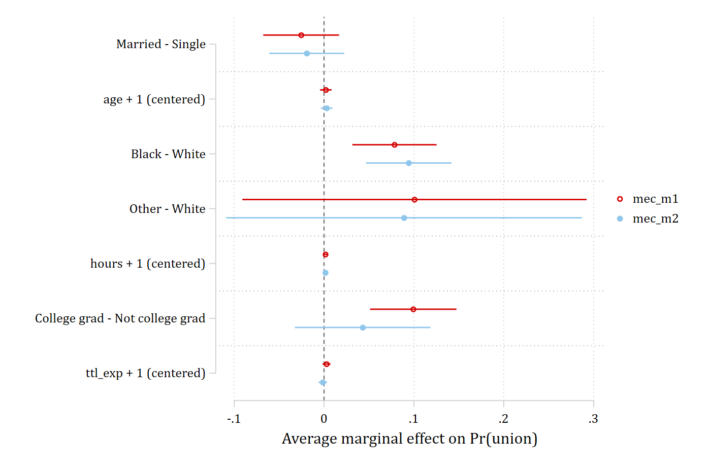
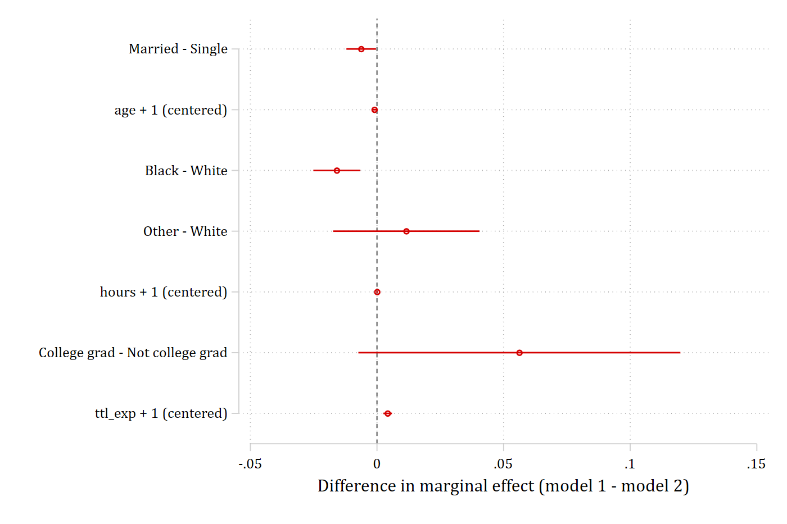
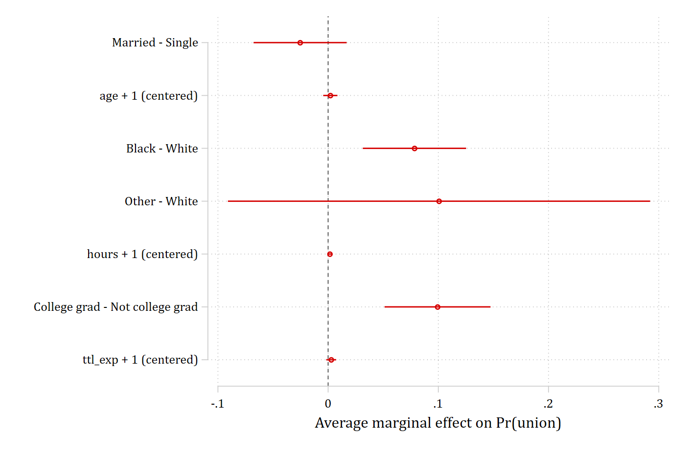
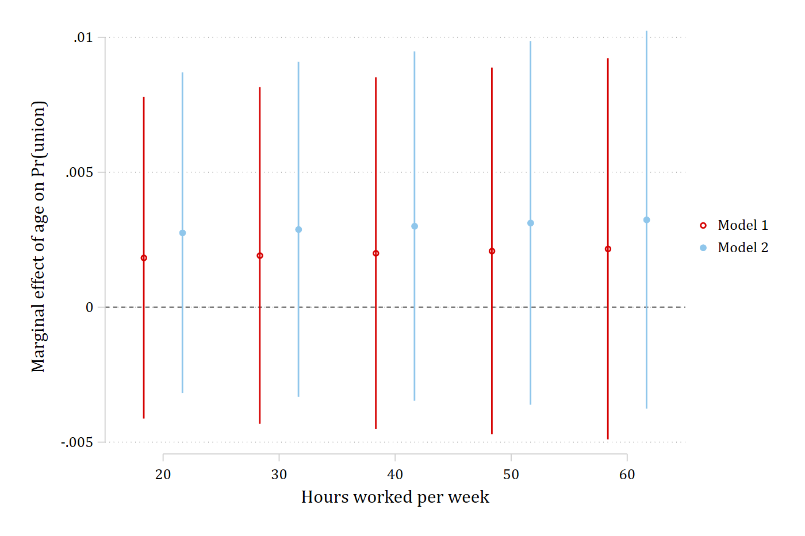

The `store(stub)` option saves the marginal effects as stored estimates -- one
for each model and one for the differences -- so that `coefplot` and `esttab`
(Jann) can plot and table them. Install both once with `ssc install coefplot`
and `ssc install estout`.

## Fit, store, compare

```{.stata-run}
. sysuse nlsw88, clear
(NLSW, 1988 extract)

. drop if missing(union, married, age, race, hours, collgrad, ttl_exp, grade, wage)
(371 observations deleted)

. 
. quietly logit union i.married age i.race hours i.collgrad ttl_exp, vce(robust)

. estimates store m1

. quietly logit union i.married age i.race hours i.collgrad ttl_exp grade wage, vce(robust)

. estimates store m2

. 
. mecompare i.married age i.race hours i.collgrad ttl_exp, models(m1 m2) store(mec)

Predicting: Pr(union)
Marginal effects and cross-model differences (N_m1=1875) (N_m2=1875)

                                 |  ME #   Estimate  Robust SE      P>|z|
---------------------------------+---------------------------------------
married                          |                                       
            Married - Single     |                                       
                              m1 |     1     -0.025      0.022      0.238
                              m2 |     2     -0.019      0.021      0.367
                      Difference |     3     -0.006      0.003      0.036
---------------------------------+---------------------------------------
age + 1 (centered)               |                                       
                              m1 |     4      0.002      0.003      0.547
                              m2 |     5      0.003      0.003      0.363
                      Difference |     6     -0.001      0.001      0.049
---------------------------------+---------------------------------------
race                             |                                       
               Black - White     |                                       
                              m1 |     7      0.078      0.024      0.001
                              m2 |     8      0.094      0.024      0.000
                      Difference |     9     -0.016      0.005      0.001
               Other - White     |                                       
                              m1 |    10      0.101      0.098      0.303
                              m2 |    11      0.089      0.101      0.378
                      Difference |    12      0.012      0.015      0.432
---------------------------------+---------------------------------------
hours + 1 (centered)             |                                       
                              m1 |    13      0.002      0.001      0.132
                              m2 |    14      0.002      0.001      0.153
                      Difference |    15      0.000      0.000      0.724
---------------------------------+---------------------------------------
collgrad                         |                                       
    College gra - Not colleg     |                                       
                              m1 |    16      0.099      0.025      0.000
                              m2 |    17      0.043      0.039      0.264
                      Difference |    18      0.056      0.032      0.083
---------------------------------+---------------------------------------
ttl exp + 1 (centered)           |                                       
                              m1 |    19      0.003      0.002      0.223
                              m2 |    20     -0.001      0.002      0.558
                      Difference |    21      0.004      0.001      0.000

```

This saved `mec_m1`, `mec_m2`, and `mec_diff`.

## Plotting both models' marginal effects

```{.stata-run}
. coefplot mec_m1 mec_m2, xline(0) xtitle("Average marginal effect on Pr(union)")

. graph export "fig/plotting-both-models.png", replace width(1400)
file fig/plotting-both-models.png saved as PNG format

```

{width=80%}

## Plotting the cross-model differences

```{.stata-run}
. coefplot mec_diff, xline(0) xtitle("Difference in marginal effect (model 1 - model 2)")

. graph export "fig/plotting-differences.png", replace width(1400)
file fig/plotting-differences.png saved as PNG format

```

{width=80%}

## A three-column table

```{.stata-run}
. esttab mec_m1 mec_m2 mec_diff, se mtitles("Model 1" "Model 2" "Difference") nonumbers

------------------------------------------------------------
                  Model 1         Model 2      Difference   
------------------------------------------------------------
Married - ~e      -0.0254         -0.0192        -0.00624*  
                 (0.0215)        (0.0213)       (0.00298)   

age + 1 (c~)      0.00198         0.00297       -0.000994*  
                (0.00329)       (0.00327)      (0.000506)   

Black - Wh~e       0.0783**        0.0942***      -0.0159***
                 (0.0239)        (0.0243)       (0.00473)   

Other - Wh~e        0.101          0.0890          0.0116   
                 (0.0977)         (0.101)        (0.0148)   

hours + 1 ~)      0.00156         0.00150       0.0000601   
                (0.00104)       (0.00105)      (0.000170)   

College gr~d       0.0993***       0.0430          0.0562   
                 (0.0245)        (0.0385)        (0.0324)   

ttl_exp + ~)      0.00279        -0.00143         0.00421***
                (0.00229)       (0.00244)      (0.000867)   
------------------------------------------------------------
N                    1875            1875            1875   
------------------------------------------------------------
Standard errors in parentheses
* p<0.05, ** p<0.01, *** p<0.001

```

`esttab` takes all of its usual options (`b(3)`, `star`, `label`,
`using file.rtf`, ...), so the same line writes a publication table.

## One model

With one model `store()` saves a single estimate, *stub* followed by the model's
name (`me1_m1` here):

```{.stata-run}
. mecompare i.married age i.race hours i.collgrad ttl_exp, models(m1) store(me1)

Predicting: Pr(union)
Marginal effects (N_m1=1875)

                                 |  ME #   Estimate  Robust SE      P>|z|
---------------------------------+---------------------------------------
married                          |                                       
            Married - Single     |                                       
                              m1 |     1     -0.025      0.022      0.238
---------------------------------+---------------------------------------
age + 1 (centered)               |                                       
                              m1 |     2      0.002      0.003      0.547
---------------------------------+---------------------------------------
race                             |                                       
               Black - White     |                                       
                              m1 |     3      0.078      0.024      0.001
               Other - White     |                                       
                              m1 |     4      0.101      0.098      0.303
---------------------------------+---------------------------------------
hours + 1 (centered)             |                                       
                              m1 |     5      0.002      0.001      0.132
---------------------------------+---------------------------------------
collgrad                         |                                       
    College gra - Not colleg     |                                       
                              m1 |     6      0.099      0.025      0.000
---------------------------------+---------------------------------------
ttl exp + 1 (centered)           |                                       
                              m1 |     7      0.003      0.002      0.223

. coefplot me1_m1, xline(0) xtitle("Average marginal effect on Pr(union)")

. graph export "fig/plotting-one-model.png", replace width(1400)
file fig/plotting-one-model.png saved as PNG format

```

{width=80%}

## Effects across levels of a moderator

With `by()`, `over()`, or a `covariates()` value list, each stored estimate
carries one coefficient per level, so the plot shows how an effect changes
across the moderator. The coefficients are named with the table's labels, e.g.
`age + 1 (centered), hours=20`; `rename()` with a regular expression keeps the
value after the `=`.

```{.stata-run}
. mecompare age, models(m1 m2) covariates(hours=(20 30 40 50 60)) store(byhrs)

Predicting: Pr(union)
Marginal effects and cross-model differences (N_m1=1875) (N_m2=1875)

                                 |  ME #   Estimate  Robust SE      P>|z|
---------------------------------+---------------------------------------
age + 1 (centered)               |                                       
                     m1 hours=20 |     1      0.002      0.003      0.547
                     m1 hours=30 |     2      0.002      0.003      0.547
                     m1 hours=40 |     3      0.002      0.003      0.547
                     m1 hours=50 |     4      0.002      0.003      0.548
                     m1 hours=60 |     5      0.002      0.004      0.548
                     m2 hours=20 |     6      0.003      0.003      0.362
                     m2 hours=30 |     7      0.003      0.003      0.362
                     m2 hours=40 |     8      0.003      0.003      0.363
                     m2 hours=50 |     9      0.003      0.003      0.364
                     m2 hours=60 |    10      0.003      0.004      0.364
             Difference hours=20 |    11     -0.001      0.000      0.051
             Difference hours=30 |    12     -0.001      0.000      0.050
             Difference hours=40 |    13     -0.001      0.001      0.050
             Difference hours=50 |    14     -0.001      0.001      0.050
             Difference hours=60 |    15     -0.001      0.001      0.052

. coefplot (byhrs_m1, label("Model 1")) (byhrs_m2, label("Model 2")), vertical yline(0) ///
>     rename("^.*=(.*)$" = \1, regex) ///
>     xtitle("Hours worked per week") ytitle("Marginal effect of age on Pr(union)")

. graph export "fig/plotting-moderator.png", replace width(1400)
file fig/plotting-moderator.png saved as PNG format

```

{width=80%}

The [interactions pages](interactions/index.html) use this pattern to
reproduce the marginal-effect figures of Mize (2019).
